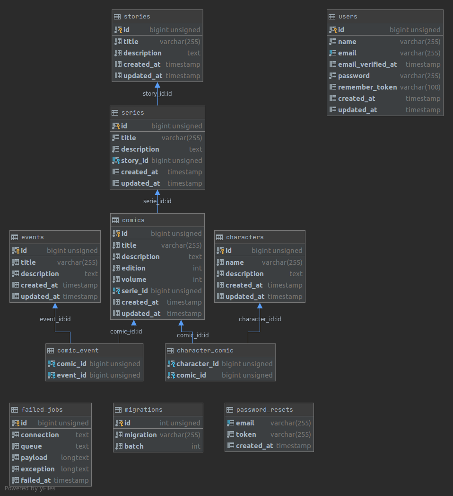

# MarvelHeroes


### How entities are thinked:

As the television series as formed, the comics structs were thinked.
A television series (an story) has some seasons and each season has its episodes. Each episode has its characters and events. Knowing that, i made the parallel:

- Comic are the physical or digital products that end-users read; Each Comic has its Characters and Events.
- Comics belong to a Series (**called serie, just to have a plural form on Laravel**);
- A Story has a lot of Series.

So, the DB diagram can be seen on the figure below:




### 1. Setup

- Clone repository:

	```cmd
	git clone https://github.com/carlosgcarneiro/MarvelHeroes.git
	```
	
- Download libraries:
	```cmd
	composer install
	``` 	
	
- Copy ``.env.example`` to ``.env``;

- Configure ``.env``;

- Install libraries:

	```cmd
	composer install
	``` 
	
- Generate and seed the database:

	```cmd
	php artisan migrate:fresh --seed
	``` 
	
### 2. Run server

After install the application, on the project folder, you should run:

```cmd
php artisan serve
```

Later, on your favourite browser, type the url shown on the prompt. As example, on the picture bellow, you should type http://127.0.0.1:8000 .


### 3. Using API

(Even having an authentication service via jwt, all the routes below are publics.)

- api/v1/public/characters;
	+	return all characters and its respective comics.

- api//v1/public/characters/{characterId}
	+	return an espefic characters and all related relationships.

- api//v1/public/characters/{characterId}/comics
	+ return an espefic characters and its respective comics.


- api//v1/public/characters/{characterId}/events
	+ return an espefic characters and its respective events.


- api//v1/public/characters/{characterId}/series
	+ return an espefic characters and its respective series.


- api//v1/public/characters/{characterId}/stories
	+ return an espefic characters and its respective stories.
	

If the API receive an invalid *characterId* it will return an empty json.


